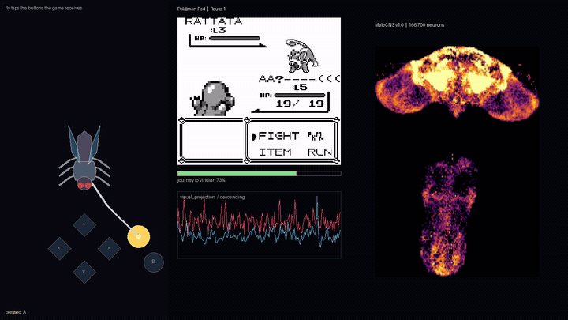

# fly-plays-games

A real fruit-fly connectome, running on a laptop CPU, plugged into video games.



The brain is real: [MaleCNS v1.0](https://male-cns.janelia.org), 166,700 neurons
and ~25.6 million connections, wired as electron microscopy found them, simulated
as a leaky integrate-and-fire network with **frozen weights**. The games are real:
Game Boy titles under [PyBoy](https://github.com/Baekalfen/PyBoy), driven only by
button presses. What the fly *decides* is small: a readout on its descending
neurons picks a button. This repository is the honest version of the "fly plays X"
genre: the connectome is genuinely in the loop, and it is just as genuinely not a
player.

---

## The idea

There is a genre of viral clip where a brain in a dish, or a connectome, or a
neural culture, "plays" Doom, Minecraft or Pokémon. Most of them are hard to
audit. This project builds the same kind of thing in the open, across several
games, and tries to be explicit about three things:

1. **What is simulated for real** -- the whole adult fly central nervous system,
   frozen, in the game loop.
2. **What is handed to it** -- where the objects are, and the scripted teacher.
3. **What it can and cannot do** -- fast reflexes: yes; memory and planning: no.

## The shared pipeline

Once per 20 ms game frame:

```
screen pixels ─▶ visual projection neurons ─▶ the connectome ─▶ descending neurons ─▶ readout ─▶ button
                (LPLC2 / LC4 / LPLC1 / LC10a)   (166,700, frozen)   (~1,300)          (trained)
```

* **Visual front end** (`FeatureDetectors`, from `flybrain/eyes.py`). The scene is
  reduced to an "object at `dx`" signal and injected directly into the fly's own
  visual projection neuron types: **LPLC2** for looming, **LC4** for fast
  looming/escape, **LPLC1** for small approaching objects, **LC10a** for a target
  to chase. Left and right eye are driven from the sign of `dx`. This front end is
  a **model**: the object's position is supplied, because the "proper" route -- the
  6,006 photoreceptors via `Eyes.drive` -- fades at the lamina in a spiking model
  and never reaches the brain. Everything *downstream* of these neurons is the
  connectome.
* **The connectome** (`FlyBrain`). MaleCNS v1.0 as a leaky integrate-and-fire
  network, `dt = 20 ms`, `tau = 100 ms`, `gain = 3.0`, `tonic = 0.14`. Nothing
  inside it is trained. On CPU it runs at roughly 150+ steps/s for one fly.
* **Decoding** (`Trace`, `Readout`). A decaying spike trace over the descending
  neurons is compressed to principal components and a small linear/logistic readout
  maps it to a button. Only this readout is trained; its hyper-parameters and score
  come from cross-validation.

Each game adds a thin adapter (how to run the ROM and read its state) and reuses
the same brain, front end, readout and reflex.

## The games

| Game | Folder | Status | What the fly does |
| --- | --- | --- | --- |
| Pokémon Red | [`pokemon-red/`](pokemon-red/README.md) | done | reacts to the screen; the long walk is a scripted teacher |
| Retroid (Arkanoid) | [`retroid/`](retroid/README.md) | planned | keep the paddle under the ball (left/right tracking) |

## What is real, and what is not

* The connectome, its spiking activity and the button presses are **real**.
* The objects' positions, the navigation and (in the videos) the long walk are
  **handed to it**, not perceived: the fly reacts, it does not steer or plan.
* The fly has **no plasticity and no long-term memory**: the weights never change.
  It can do fast, hard-wired sensorimotor reflexes -- looming, escape, target
  tracking -- but it cannot hold a map or learn the delayed-reward structure a game
  like Pokémon needs.

Each game's README has its own video, measurements and caveats.

## Setup (shared)

From the repository root:

```sh
python -m venv .venv && . .venv/bin/activate
pip install -r requirements.txt
git clone https://github.com/alextitonis/fly.ai fly-ai     # the flybrain package
```

`FlyBrain` downloads `brain.npz` and `weights.npz` (~260 MB) on first use into
`data/fly-data` (or `$FLY_DATA`). Each game then needs its own ROM, described in
its README; no ROM is committed.

## Layout

```
pokemon-red/     the Pokémon Red chapter (adapter, render scripts, README)
retroid/         the Arkanoid chapter (planned)
fly-ai/          the upstream flybrain package (MIT) -- not committed, clone it
data/            connectome files -- not committed
requirements.txt, LICENSE
```

## Credits and license

Project code: **MIT** (see `LICENSE`).

The connectome is **MaleCNS v1.0** by FlyEM (HHMI Janelia), the University of
Cambridge, the MRC Laboratory of Molecular Biology and Google Research, used under
[CC BY 4.0](https://male-cns.janelia.org/download/). If you use it, cite:

* Berg, S. et al. (2026). *Sexual dimorphism in the complete connectome of the
  Drosophila male central nervous system.* Cell.

The neuron model follows the hand-calibrated dynamics of Fly64 by Jessica Paquette.
Pipeline references:

* Shiu, P. K. et al. (2024). *A leaky integrate-and-fire computational model based
  on the entire connectome of the Drosophila brain.* Nature.
* Dorkenwald, S. et al. (2024). *Neuronal wiring diagram of an adult brain.* Nature
  (FlyWire).
* Wang-Chen, S. et al. (2024). *NeuroMechFly v2.* Nature Methods.

`fly-ai/` is the upstream [fly.ai](https://github.com/alextitonis/fly.ai) project
(MIT). Pokémon is a trademark of Nintendo / Game Freak / Creatures. Retroid is a
free homebrew Game Boy game by Jonas Fischbach. No ROM is distributed here.
