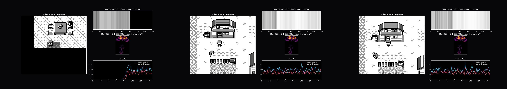
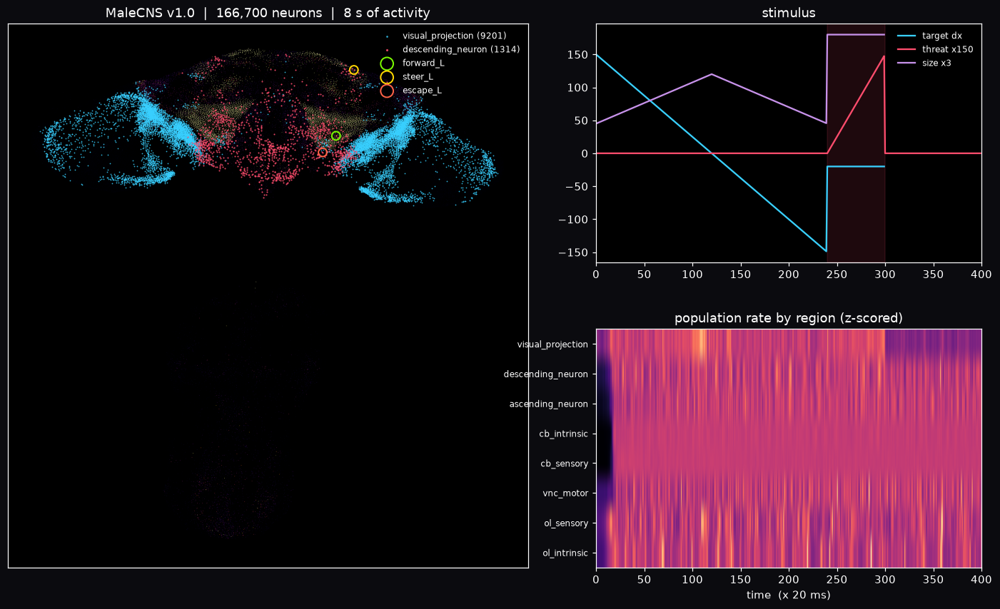

# fly-plays-pokemon

A real fruit-fly connectome, running on a laptop CPU, plugged into Pokémon Red.


The brain is real: [MaleCNS v1.0](https://male-cns.janelia.org), 166,700
neurons and ~25.6 million connections, wired as electron microscopy found them,
simulated as a leaky integrate-and-fire network with **frozen weights**. The game
is real: Pokémon Red under [PyBoy](https://github.com/Baekalfen/PyBoy), driven
only by button presses. What the fly *decides* is small: a readout on its
descending neurons picks a button. And the long walk from Pallet Town to Viridian
City is a **scripted teacher**, not the fly. This repository is the honest version
of the "fly plays X" genre: the connectome is genuinely in the loop, and it is
just as genuinely not a player.

---

## 1. What I wanted to do

There is a genre of viral clip where a brain in a dish, or a connectome, or a
neural culture, "plays" Doom, Minecraft or Pokémon. Most of them are hard to
audit. I wanted to build one in the open and answer three questions:

1. Can you take the **whole adult fly central nervous system** and run it in a
   game loop on ordinary hardware?
2. If the connectome drives the buttons, does the game make sense to it?
3. What, honestly, does it take for "a connectome plays X" to mean something?

---

## 2. What I actually built

The loop, once per 20 ms game frame:

```
screen pixels ─▶ visual projection neurons ─▶ the connectome ─▶ descending neurons ─▶ readout ─▶ button
                (LPLC2 / LC4 / LPLC1 / LC10a)   (166,700, frozen)   (~1,300)          (trained)
```

* **Visual front end** (`FeatureDetectors`, from `flybrain/eyes.py`). The screen
  is reduced to an "object at `dx`" signal and injected directly into the fly's
  own visual projection neuron types: **LPLC2** for looming, **LC4** for fast
  looming/escape, **LPLC1** for small approaching objects, **LC10a** for a
  target to chase. Left and right eye are driven from the sign of `dx`. This front
  end is a model; like Eon's embodied fly, everything *downstream* of these
  neurons is the connectome. (The "proper" route -- the 6,006 photoreceptors via
  `Eyes.drive` -- fades at the lamina in a spiking model and does not reach the
  brain, so it is kept only for reference.)
* **The connectome** (`FlyBrain`). MaleCNS v1.0 as a leaky integrate-and-fire
  network, `dt = 20 ms`, `tau = 100 ms`, `gain = 3.0`, `tonic = 0.14`. Nothing
  inside it is trained. On CPU it runs at roughly 150+ steps/s for one fly.
* **Decoding** (`Trace`, `Readout`). A decaying spike trace over the descending
  neurons is compressed to principal components and a small linear/logistic
  readout maps it to a button. Only this readout is trained; its hyper-parameters
  and score come from cross-validation.

The game side is a single thin adapter (`pokesim/adapter.py`) that knows PyBoy,
the ROM and the Red RAM map. Everything above it talks in plain Python.

### Who does what

* **Teacher** (`render/record_journey.py`). A planner that reads the game's RAM
  and walks: it builds a map from the live tilemap, learns which tiles are
  walkable, searches the frontier toward the north, and flees wild battles. It
  presses the buttons in the video, and it really does reach Viridian City.
* **The fly** (`play_live.py`, `pokesim/loop.py`). The connectome is genuinely in
  the loop: it gets the screen, fires, and a readout on its descending neurons can
  pick a button. It reacts; it does not navigate.

---

## 3. What is real in the video, and what is not

* The game, the button presses and the **connectome activity are real**. The
  right-hand panel is one dot per neuron, in a 2D projection of its measured
  position, lighting up as it spikes, driven by the live screen.
* The fly is a **stylised drawing**, not a biomechanical body. I deliberately
  did not adopt NeuroMechFly/MuJoCo here; a rigid 3D body on CPU would be slow
  and would not change what the brain is doing.
* The **navigation is the teacher**. The fly is not steering from Pallet to
  Viridian. The little leg on the gamepad is showing you which button the game
  receives, not a decision made by the connectome.



---

## 4. What I measured

**The connectome does carry the signal.** With the oracle offset (the true
`dx` read from RAM) driving the visual projection neurons, a logistic readout on
the descending-neuron trace recovers which side the object is on with a
**cross-validated AUC of ~0.95**, and behavioural rollouts track an oracle
controller. A shuffled-label control sits at chance, so the number is not an
artefact of autocorrelated windows.



**Why it reacts but does not play.** The LIF connectome **has no long-term memory
and no plasticity**: its weights never change, so it cannot hold a map or learn
the delayed-reward structure a game like Pokémon needs (a gym leader is many
correct decisions away from any reward). What it *can* do is fast, hard-wired
sensorimotor reflexes -- looming, escape, target tracking -- which is exactly what
the descending-neuron result shows. That is why the long walk in the video is a
scripted teacher and the fly is a passenger.

So the honest headline is: **you can put a real connectome in a game loop, and it
will react like a fly, but it will not play the game.** Demos that look like
cognition are, I suspect, mostly reflexes with a lot of scaffolding around them.

---

## 5. Layout

```
pokesim/                  game <-> brain glue
  adapter.py              the only PyBoy / ROM / RAM module
  encoder_b.py            oracle encoder: exact game state -> visual channels
  compare.py              connectome readout, blocked CV + shuffled control
  loop.py                 rollout, oracle controller, descending-neuron features
fly-ai/                   the flybrain package (upstream, MIT) -- clone it, see Setup
render/
  record_journey.py       teacher journey -> render/recording.npz (--window SDL2 to watch)
  render_journey.py       recording -> media/viridian_final.mp4 (PIL piped to ffmpeg)
play_live.py              connectome decides, PyBoy window
media/                    the top GIF, figures, and video (mp4 not committed)
roms/                     your ROM and scene bookmarks (not committed)
data/                     connectome files (not committed)
```

---

## 6. Setup

### 6.1 Python

```sh
python -m venv .venv && . .venv/bin/activate
pip install -r requirements.txt
```

### 6.2 The connectome code (`fly-ai/`)

`fly-ai/` is the upstream [`flybrain`](https://github.com/alextitonis/fly.ai)
package and is **not committed** (it is a large repo with a web app, voices and 3D
models). Clone it into place:

```sh
git clone https://github.com/alextitonis/fly.ai fly-ai
```

The scripts put `fly-ai/` on `sys.path`, so no install is needed.

### 6.3 The brain files

`FlyBrain` needs `brain.npz` and `weights.npz` (~260 MB). They are downloaded
automatically on first use into `$FLY_DATA`, or into the folder you pass:

```sh
export FLY_DATA="$PWD/data/fly-data"     # optional; the scripts pass this anyway
```

### 6.4 The ROM

You must supply your own **Pokémon Red (USA/Europe)** ROM; it is copyrighted and
not included. Put it at `roms/pokered.gb`. The RAM addresses in `pokesim/adapter.py`
match the [pret/pokered](https://github.com/pret/pokered) disassembly for this
dump:

```
SHA1  ea9bcae617fdf159b045185467ae58b2e4a48b9a
```

(The optional `reference/pokered/pokered.sym`, from that repo, lets you read
state by symbol name; I read numeric RAM addresses instead.)

### 6.5 Scenes

`roms/scenes/*.state` are PyBoy save states I bookmarked during experiments and
they are not committed. Any script can create one:

```sh
python play_live.py --make-scene overworld     # walks the intro, bookmarks the bedroom
```

The live viewer falls back to the auto-created bedroom scene when the one you ask
for is missing. `record_journey.py` expects the `pallet` and `route1` bookmarks.

---

## 7. Running it

### Watch the connectome decide

```sh
python play_live.py --scene route1 --scale 4
```

This opens PyBoy in a window and lets the **connectome** choose left/right, via a
readout it fits at startup on a synthetic sweep of offsets. It is a reflex
(facing the nearest object), it is real, and it is small on purpose.

### Watch the scripted teacher walk

```sh
python render/record_journey.py --window SDL2 --scale 4
```

Same navigator that made the video, but you can see it. With the default
`--window null` it records headlessly to `render/recording.npz`.

### Render the video

```sh
python render/record_journey.py          # writes render/recording.npz (~65 s)
python render/render_journey.py          # writes media/viridian_final.mp4 (~2 min)
```

The renderer composites the fly/gamepad, the game and the connectome map with PIL
and pipes raw frames to `ffmpeg`, then time-lapses to ~105 s at 25 fps.

---

## 8. Reproducing the numbers

The measurement code keeps to honest protocols:

* **Blocked / leave-one-group-out CV** in `Readout.fit`: samples from the same
  recording block never land in both train and test.
* **A shuffled-label control** in `compare.py`: permuting the labels must collapse
  the score to chance.
* **A fresh brain reset per sample** in `_features_per_sample`: frames are
  autocorrelated, so samples are made independent on purpose.

Run the connectome readout from a Python shell:

```python
import numpy as np, sys
sys.path.insert(0, "."); sys.path.insert(0, "fly-ai")
from flybrain import FlyBrain
from pokesim import PokemonAdapter
from pokesim.compare import compare_per_sample
# ... collect dxs, side and blocks from a walk, then:
# compare_per_sample(brain, dxs, side, blocks)
```

---

## 9. Credits and license

Project code: **MIT** (see `LICENSE`).

The connectome is **MaleCNS v1.0** by FlyEM (HHMI Janelia), the University of
Cambridge, the MRC Laboratory of Molecular Biology and Google Research, used
under [CC BY 4.0](https://male-cns.janelia.org/download/). If you use it, cite:

* Berg, S. et al. (2026). *Sexual dimorphism in the complete connectome of the
  Drosophila male central nervous system.* Cell.

The neuron model follows the hand-calibrated dynamics of Fly64 by Jessica
Paquette. Pipeline references:

* Shiu, P. K. et al. (2024). *A leaky integrate-and-fire computational model
  based on the entire connectome of the Drosophila brain.* Nature.
* Dorkenwald, S. et al. (2024). *Neuronal wiring diagram of an adult brain.*
  Nature (FlyWire).
* Wang-Chen, S. et al. (2024). *NeuroMechFly v2.* Nature Methods.

`fly-ai/` is the upstream [fly.ai](https://github.com/alextitonis/fly.ai) project
(MIT). Its brain files are downloaded from its release page. Pokémon is a
trademark of Nintendo / Game Freak / Creatures; no ROM is distributed here.
