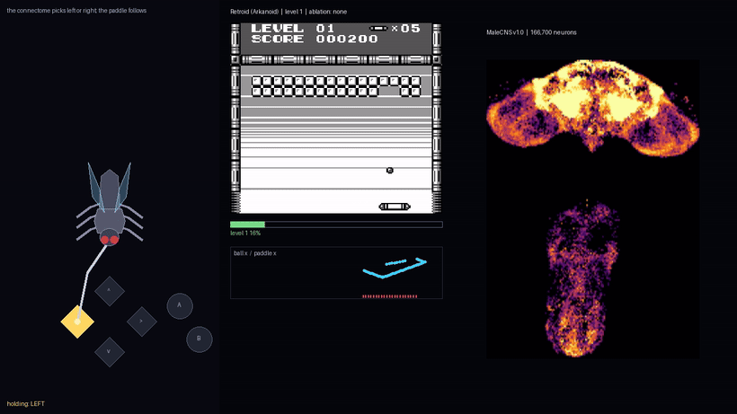
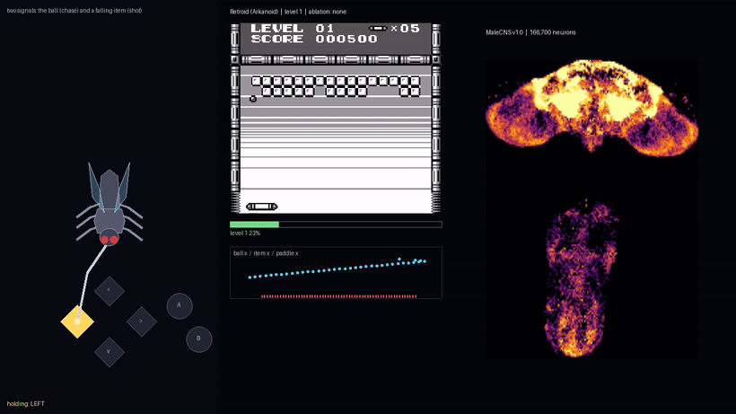
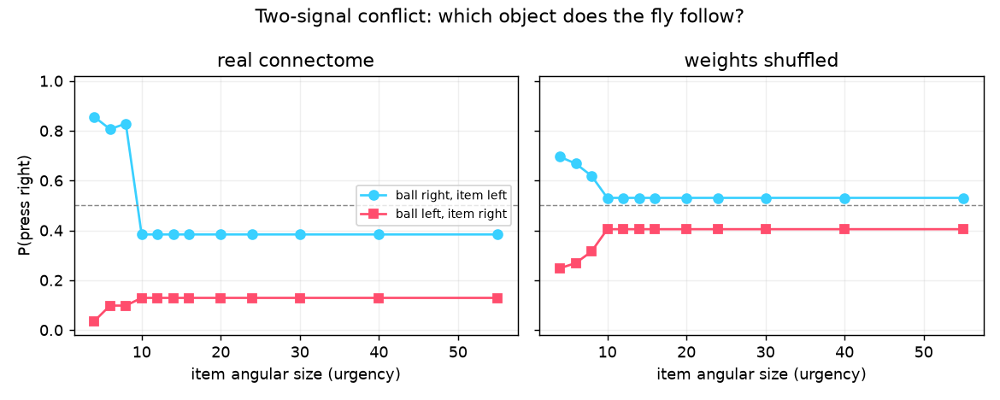
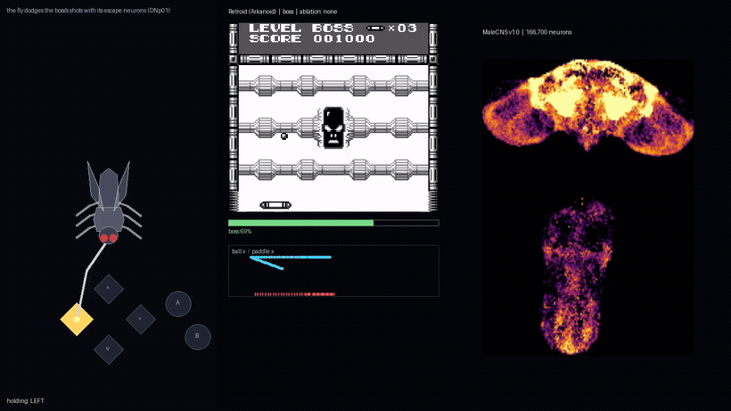

# Retroid (Game Boy)

*Part of [fly-plays-games](../README.md): a real fruit-fly connectome driving games.*

**Status: working (level 1, and the boss).** The fly connectome tracks the ball
with the paddle and keeps it alive; an ablation shows the specific *wiring* -- not
the weight values -- is what carries the signal. On the boss it dodges the shots
with its own escape neurons (DNp01) and beats it. Same brain, same visual front
end and same readout as the Pokémon Red chapter; only the game adapter is new.



## The game

[Retroid](https://jonas-fischbach.itch.io/retroid) is a free, non-commercial
homebrew **Arkanoid / Breakout** clone for the original Game Boy, by **Jonas
Fischbach** (2016). A paddle at the bottom bounces a ball into a wall of bricks.

**Thank you, Jonas.** Retroid is entirely his work and he released the ROM for
free; this chapter only borrows it, and none of it would exist without his game.
His homebrew Game Boy projects live at
[the-green-screen.com](https://the-green-screen.com/), and Retroid is a free
download on [itch.io](https://jonas-fischbach.itch.io/retroid).

It fits the fly far better than Pokémon does:

* **One axis, one decision.** The paddle only moves left/right, which is exactly
  the fly's left/right output. No remapping is needed.
* **No memory.** The ball and bricks are on screen; nothing has to be carried
  across steps. The fly's missing long-term memory does not matter here.
* **A pure reflex.** "Keep the paddle under the ball" is continuous tracking and
  is forgiving about timing.

## How it works

The Game Boy draws the ball and paddle as hardware sprites, so the adapter reads
them from the OAM table at `$FE00` instead of reverse-engineering WRAM. Each of
the 40 slots is four bytes `(screen y, screen x, tile, attributes)`; Retroid keeps
the **ball in tile `$00`**, the **paddle in tiles `$01`–`$03`** (plus the power-up
forms `$04`/`$05` and `$1B`–`$20`, so a transformed paddle is still found) and the
boss's **shots in tiles `$23`/`$24`**. The adapter finds them by tile, so it does
not care about the slot order. The HUD lives are a WRAM byte at `$C457`.
Everything else is the shared pipeline:

```
ball offset dx ─▶ visual projection neurons ─▶ the connectome ─▶ descending neurons ─▶ readout ─▶ left/right
                 (LPLC2 / LC4 / LPLC1 / LC10a)   (166,700, frozen)   (~1,300)          (trained)
```

* **Adapter** (`retroidsim/adapter.py`). Runs the ROM under PyBoy, navigates the
  fixed opening (the paddle slides in from the left and ignores input until it
  stops), bookmarks the level-1 start as a scene, launches the ball, and exposes
  `paddle_x`, `ball_x/y` and `dx = ball_x - paddle_x`.
* **Encoder** (`retroidsim/encoder.py`). Injects `dx` into the fly's visual
  projection neurons through `FeatureDetectors`, then reads the descending-neuron
  trace. As in Pokémon, the ball's position is **handed to** the visual front end
  (the photoreceptor route fades at the lamina in a spiking model); the connectome
  only does visual projection neurons → descending neurons.
* **Readout**. A logistic map over the descending-neuron trace, fit at startup on
  a synthetic sweep of offsets labelled by side (`dx > 0`). The connectome's
  weights never change; only this readout is trained.

## Results

From the level-1 start, the fly keeps the ball alive longer than a scripted
dead-zone tracker that reads the same sprite position:

| Driver | first ball lost |
| --- | --- |
| scripted tracker (dead-zone 2 px) | frame 2344 |
| **fly (connectome + readout)** | frame 4002 |

## What the ablation says

The honest test is not "can the fly play" but "does the connectome matter". The
`record_fly.py --ablate` option scrambles the connectome's weights in place and
**retrains the readout** on the scrambled brain:

| Ablation | frames in play (of 800) | mean \|dx\| |
| --- | --- | --- |
| `none` (real connectome) | 800 | 2.9 px |
| `shuffle` (weights shuffled) | 800 | 2.9 px |
| `rewire` (topology randomized) | 749 | 30.6 px |
| `silence` (weights zeroed) | 749 | 30.6 px |

The deflating but honest result: **a shuffled connectome tracks the ball exactly
as well as the real one**, because the task is one-dimensional and the side is
linearly decodable from almost any encoding. So the connectome is genuinely in the
loop and genuinely produces the button presses, but for a single left/right reflex
its **weight values are not necessary**. What *is* necessary is the wiring: break
the topology (`rewire`) or the synapses (`silence`) and the reflex collapses.

(Note: the readout's cross-validated AUC reads 1.000 even for `silence`, where the
descending-neuron trace is identical for left and right. For degenerate features
the AUC is not meaningful, which is why the table above reports the closed-loop
score instead.)

Two ablations do break the reflex: **`rewire`** (every neuron keeps its number of
inputs but draws them from random neurons) and **`silence`**. Both flatten the
descending-neuron trace -- it becomes *identical* for every ball offset -- so the
readout outputs a constant and the paddle stops tracking. The side is therefore
carried by the **wiring**, not by the weight values. (The readout still *reports*
AUC 1.000 in both cases: the upstream `auc` scores tied predictions as if they were
ordered, so a constant output comes out at 1.000 instead of 0.5. Another reason the
closed-loop score above is the honest one.)

## Survival: the game's own outcome

`mean |dx|` is a proxy. Retroid has a real outcome: when the ball passes the
paddle you lose a life, and the ball sprite disappears from the OAM table. So the
honest score is **frames until the first lost ball**, with the fly relaunching
after each loss like a player (`render/survival.py`). Four starting scenes (the
level start plus three mid-flight snapshots from `render/make_scenes.py`), cap 1500
frames; `shuffle`/`rewire`/`random` run over two seeds.

| Driver | frames to first lost ball (mean over 4 scenes) |
| --- | --- |
| **fly, real connectome** | **>1500 (never lost)** |
| fly, weights shuffled | >1500 (never lost) |
| fly, topology rewired | 204 |
| fly, weights silenced | 204 |
| scripted tracker (oracle) | 1372 |
| random paddle | 111 / 174 |
| no input at all | 162 |

The fly keeps the ball alive through all 1500 frames from every scene, and so does
a fly whose *weights* are scrambled. But randomise the *wiring* -- or zero the
weights -- and it loses the ball in about 200 frames, no better than a random
paddle. `rewire` and `silence` are numerically identical here because both flatten
the descending-neuron trace to a constant, so the paddle gets the same fixed
command. This is the same picture as the proxy, now with a real consequence: for a
single reflex the weight values are not needed, but the specific wiring is.

(Without the cap, the fly loses its first ball at frame 4002 from the level start,
against 2344 for the scripted tracker.)

## Two signals: the ball against a falling item

The single-reflex tests above show the connectome's *weights* are not necessary for
a one-dimensional task. So here is a conflict: the ball and a falling item appear at
once, on opposite sides, and the fly has to pick one.



### The readout's "choice" was an offset

The first version drove the ball through the chase channel (`opp` → LC10a) and the
item through the projectile channel (`shots` → LPLC1), with the readout trained only
on single-object trials so that it never saw a conflict. `render/conflict_paired.py`
evaluates a real and a shuffled readout on the **same** states; on 161 conflict frames
the real one appeared to follow the item **60%** of the time against the shuffled one's
16%, and they disagreed on 44%. Two probes say that number is not what it looks like:

* **Channel swap** (`--swap`). Putting the ball on `shots` and the item on `opp` gives
  the *identical* trajectory (161 conflicts, item 60%). The choice is not the channel
  assignment.
* **Mirror test.** A single object is nearly antisymmetric (`p(+60)=0.96`,
  `p(-60)≈0`); the two-object conflict is **not** -- mirroring both offsets still
  leaves the answer on the left (residual -0.42). That is a **constant offset**, not a
  lateral bias.

The offset is the readout's intercept (`b = -0.42`, so the no-object answer is
`p = 0.41`, left), and it comes from the connectome: the descending-neuron population
is not left/right symmetric. With two opposing objects their contributions cancel and
the offset decides. "The fly chose the item 60%" was really "the offset happens to
point at the item". This is also why an earlier one-dimensional size sweep looked
lateral (below): it was the offset plus a weak drive. With the default front end the
chase drive pins at its cap, so the object's size barely moves the trace --
`chase_base` and `chase_gain` saturate it into a near-binary signal.



### What the connectome does by itself

Decode the descending neurons with a *fixed, untrained* rule -- sum of left DNs minus
right DNs (`--innate`) -- and the ball wins **98%** of conflicts. The chase pathway
(LC10a → DN) is about four times stronger than the projectile pathway (LPLC1 → DN), so
the ball is prioritised by **wiring**. That arbitration is the connectome's own.

### A fair conflict: one channel, physical urgency

To compare the two objects on equal footing, route *both* through the chase channel
(`--chase2`) and let a **physical urgency** set each one's drive. `object_demand`
(`retroidsim/encoder.py`) scores an object by proximity × imminence: angular size is
`k / dist`, loom rate is `size / t_arrive` (zero while the object ascends). Those are
the quantities a loom detector (LPLC2) responds to, so the front end is doing the eye's
job; the only non-sensory part is `stake` -- that the ball is worth more than the item
is Arkanoid's rule, not biology.

An earlier version multiplied the loom by a **reach factor** whenever covering `|dx|`
would take the paddle longer than the object's time to arrive. That knows the actor's
motor limit, not the stimulus, and with the continuous readout it turned out to hurt
play: in ball-only runs it raised `mean |dx|` from 8.3 to 14.7 px across four scenes by
over-committing the paddle to laterally distant balls. It was removed, so the drive
above is now purely sensory. (The numbers below were measured while it was still in.)

Removing it had a second, larger cost we only measured later: the reach factor was
also what let the fly commit to a **far** item. By boosting an unreachable object's
urgency it gave the paddle a head start, and that is how the item catches below (5 of
11) happened. Without it, a laterally distant item's purely sensory urgency does not
beat the ball's constant `base` drive until the item is already too close to reach at
2 px/frame, so the fly almost never chooses it. Measured on the current code: the live
`--items` demo and the `conflict_paired --chase2 --urgency` probe both collect **0**
items, in every configuration we tried (continuous or threaded, `--vx-gain` on or off,
`--base` 0.0-0.8, `--item-stake` up to 2.0). Re-adding the reach factor restores a few
catches (1 of 2 drops in the probe, 1 in a 3000-frame live run) but drags ball tracking
back down (`mean |dx|` 9.1 -> 12.8 px, losses 7 -> 9). The item is therefore a rare
bonus the fly mostly ignores, not a decision it can make on sensation alone -- the same
boundary as the bounce, where the signal that would help is a fact about the actor, not
the world.

With the real connectome and the innate decoder, across four starting scenes, the more
urgent the ball the more the fly follows it rather than the item:

| ball demand | follows item (four scenes) |
| --- | --- |
| low (ball safe) | 60 / 74 / 57 / 81 % |
| mid | 56 / 43 / 36 / 22 % |
| high (ball urgent) | 12 / 24 / 12 / 1 % |

Every scene is monotone: an urgent ball is followed (~88% of frames), a safe ball is
abandoned for the item (~68%). Bucketed by the ball's screen height alone the same
split is **not** monotone (e.g. 17 / 78 / 80 %): an object low but ascending is not
urgent, and only including direction and speed makes the relation clean.

The fly then does catch the item. Over the four runs 11 items fell (ignoring 5
sprite-animation gaps) and it collected **5 (45%)** -- always when the ball was safe
and with the paddle under the item; the misses are mostly items on the right, because
the connectome's left lean parks the paddle left of centre.

Caveat: this is a probe, not a benchmark; the numbers depend on the encoder's
constants and on the choice of `stake`. And with the drive supplied (`--solo`) the real
and shuffled connectomes agree on almost every frame -- most of this decision is the
drive, not the connectome. The connectome-owned part is the static pathway priority
above.

## The live demo: running the brain at the game's own rate

`play_live.py` is the interactive version. A decision costs eight connectome steps
(~50 ms on CPU), so the brain decides ~19 times a second while the Game Boy runs at
60 fps. There are two ways to bridge that gap:

* **Threaded (default).** The brain runs in a background thread and the main loop
  ticks the emulator at its own pace, reading the latest decision. It works, but the
  paddle follows an answer that refreshes every few frames, so above ~20 fps it is
  always a couple of frames behind the ball. `--fps` caps the loop exactly, with a
  relative per-frame sleep (no 60 fps catch-up burst) and PyBoy's own throttle off.
* **Continuous (`--continuous`).** Never reset the brain: keep its recurrent state
  and take **one step per frame** (~4 ms, well inside a 60 fps frame). A readout is
  then fit on one long continuous run. The question was whether the noise makes the
  network drift; it does not.

Over a 3000-step continuous run the spike count and the descending-neuron trace sit
on a steady level -- no drift, no runaway -- and a readout trained on one segment
decides another at 98% (AUC 0.945, against 1.000 for the fresh 8-step response). In
the game the two modes are equivalent at 60 fps (mean |dx| 8.5 vs 9.5 px, three balls
lost in each of two runs), but the continuous one runs inline at the game's own rate.

With `--items` the live demo puts the ball and falling item on the same chase channel
and trains the readout to follow whichever asks for more (see "Two signals"), so the
urgency arbitration can be watched in real time. The drive weights are `--base 0.8`
(a constant tracking drive for the ball, so it stays tracked when safe), `--size-weight
0.1` (the ball's urgency is imminence, not proximity), `--item-stake 0.8`, and
`--item-diagonal` (the item's distance is the straight line from the paddle, so a far
one looms less).

Be clear about the split. The **brain** only picks left/right during a rally.
Launching the ball, mashing A through a GAME OVER or a menu, and driving right to a
cleared level's exit are hand-written scaffolding in `play_live.py`, not the
connectome. The drives and their weights are our choices too; the brain is the
channel they run through.

## The boss: dodging its shots with the fly's escape neurons

Level 1 is pure tracking. The **boss** (stage 21) adds a signal the fly must
survive: it fires volleys of **shots** that fall toward the paddle, and a shot
that reaches the paddle costs a life just like a lost ball. The adapter reads the
shots from the OAM table (tiles **`$23`/`$24`**) and the HUD lives byte at
**`$C457`**.



Watching the fly on the boss makes the failure mode plain: **it dies to the
shots, almost never to the ball.** Every death has the same shape -- the ball is
high and safe (y ≈ 46-64), the paddle is tracking it, and a shot lands on the
paddle's edge. The control (no escape) loses **all five lives to shots**, game
over at step 2768.

So the fly uses the organ that exists for exactly this: its **escape neurons
(DNp01)**, the giant-fiber command. `escape_sides` reads each shot's looming
urgency (the same `object_demand` as the ball, but leaning on raw proximity -- a
shot is small and on a short fuse) and delivers it to the DNp01 on the shot's
side; `escape_level` reads the reflex back off their trace with the **reflex's
own sign** (flee away from the looming side), and the chase command subtracts it.
The ball readout is untouched.

| boss, same scene | outcome |
| --- | --- |
| fly, no escape | 5 deaths to shots, game over at step 2768 |
| **fly + escape (DNp01)** | **boss beaten -- its shots stop at step ~5040, level cleared ~6030** |

The honest split: the sensor (a shot's looming) and the organ (DNp01) are the
fly's; the fixed sign of the read-back is our declared choice, like `stake`. One
cost we paid for: an early version **latched** the escape for 0.4 s after the shot
passed, which kept the paddle fleeing long after the danger was gone -- a fly
stuck in a corner, "escaping" with no shot on screen. The latch is gone; the
escape now follows the shot.

## Where the fly ends: anticipation is not prediction

The fast diagonal ball that bounces off a wall is the fly's hard case. It is not a
tuning problem, and it is not the readout's smoothing; it is a **boundary**, and we
accept it. The fly is a pursuer: it moves to where the ball *is*. A human moves to
where the ball *will be*, because they understand the rule (the ball reflects off
the wall). That is model-based prediction, and we do not inject it.

We measured the difference with a moving stimulus into the same chase channel and
cross-correlating the descending-neuron steering with the stimulus (negative lag =
the command *ahead* of the stimulus):

| stimulus | command lag, motion drive off | motion drive on |
| --- | --- | --- |
| smooth sweep (sinusoid) | +7 frames | **-4 frames** |
| wall bounce (discontinuity) | **+28 frames** | +11 frames |

Two things fall out. First, the connectome **does** anticipate smooth motion: the
ball's horizontal velocity pushes the command a few frames *ahead* of the ball's
position, a phase advance of about 11 frames. It is not a predictor we wrote; it is
the connectome using a velocity sensation. Second, it can never anticipate a
**bounce**. A bounce is a discontinuity -- the velocity reverses in a single frame --
so there is no information before it, and the command arrives ~11 frames after (the
brain's 0.1 s membrane constant plus the readout's 0.1 s trace). At 2 px/frame for
the paddle against up to 4 px/frame for the ball, 11 frames is ~22 px of head start
lost, and the ball is gone.

So the missing piece is not a better encoder. Every attempt we made -- a stronger
velocity drive, a retinotopic azimuth map, a second pathway -- improved the
*sensation*, and none could supply the missing *model of the game*. A connectome has
senses, not rules. Anticipating smooth motion is a reflex; anticipating a bounce is
understanding, and that is exactly the line the ethos keeps us on the fly's side of.

## Running it

The ROM is free from the author, **Jonas Fischbach** -- see his site
[the-green-screen.com](https://the-green-screen.com/) or the game's
[itch.io page](https://jonas-fischbach.itch.io/retroid) -- and is **not
committed**. Put it at `retroid/roms/Retroid.gb` (any filename works via `--rom`).

```sh
python retroid/play_live.py --scale 4                  # watch it, with a window
python retroid/play_live.py --scale 4 --fps 40 --items # live, also chasing the falling item
python retroid/play_live.py --scale 4 --continuous     # one connectome step per frame, 60 fps
python retroid/play_live.py --scene boss --stage 21 --continuous --escape  # the boss: dodge its shots
python retroid/play_live.py --scene boss --stage 21 --continuous           # the control: no escape
python retroid/render/record_fly.py --steps 1200       # record a run to render/fly_drive.npz
python retroid/render/render_fly.py                    # render that npz to media/retroid_fly.mp4
python retroid/render/record_fly.py --ablate shuffle   # the control condition
python retroid/render/make_scenes.py --every 450       # extra mid-flight scenes
python retroid/render/survival.py --scenes level1 --budget 1500   # lives: the real outcome
python retroid/render/conflict.py --ablate none         # two-signal arbitration
python retroid/render/conflict.py --ablate shuffle      # weights scrambled
python retroid/render/conflict.py --ablate rewire       # topology scrambled
python retroid/render/record_conflict.py --steps 3000   # the conflict in the game loop
python retroid/render/conflict_paired.py --steps 2500   # both readouts on the same states
python retroid/render/conflict_paired.py --steps 2500 --innate           # fixed L-R decoder: the ball wins by wiring
python retroid/render/conflict_paired.py --steps 2500 --chase2 --urgency # one channel + physical urgency
python retroid/render/conflict_paired.py --chase2 --urgency --scene level1_c --solo  # one scene, real only
python retroid/render/render_fly.py --input render/conflict_play.npz --start 790 --end 1030
```

## Caveats

* **Ball speed.** The ball moves up to 3 px/frame and the paddle 2 px/frame, so
  the tracking is a real control problem, not a formality. The fly holds up here.
* **Power-ups.** The falling capsule is a *second* decision (chase the ball or the
  bonus). The tracking runs ignore it; the "Two signals" section above studies it
  directly, with the item's urgency supplied by the encoder rather than measured
  from pixels. A power-up can also change the paddle's *graphic*; the adapter reads
  those tiles too (`$04`/`$05`, `$1B`–`$20`), which used to make `paddle_x` return
  `None` and freeze the fly mid-level.
* **The boss.** Its shots are read from the OAM table and its lives from `$C457`;
  `--stage 21` freezes the game on the boss so a run cannot advance past it. The
  escape is the fly's DNp01 reflex driven by a shot's looming, with a fixed sign we
  declare.
* **Levels with multiple balls** are out of reach.
* **Sprite identification** assumes the ball stays tile `$00`; a level that
  reuses that tile for something else would confuse the adapter.
* **Lost-ball detection.** A lost ball is the sprite disappearing from the OAM
  table, not the ball's height: a *caught* ball dips to y=131 at the bottom of a
  bounce, so a height threshold would misread every bounce as a lost ball and
  freeze the paddle for a few frames. (An earlier version did exactly that; the
  numbers above are from the fixed detection.)
